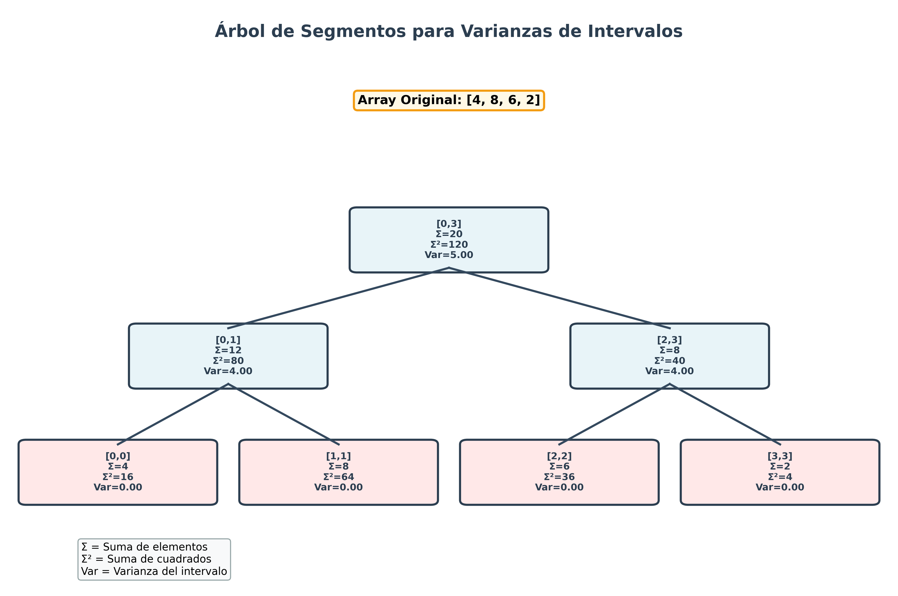

# Árbol de Segmentos para Varianzas de Intervalos

## Descripción del Proyecto

Este proyecto implementa un **Árbol de Segmentos (Segment Tree)** especializado en mantener y consultar **varianzas** de intervalos de manera eficiente. La estructura permite realizar consultas de varianza en tiempo O(log n) y actualizaciones en tiempo O(log n), lo que la hace ideal para análisis estadístico dinámico de grandes conjuntos de datos.

## ¿Qué es un Árbol de Segmentos?

Un árbol de segmentos es una estructura de datos tipo árbol que permite:
- Responder consultas sobre rangos de un array
- Actualizar valores individuales
- Ambas operaciones en tiempo logarítmico O(log n)

En este caso, nuestro árbol mantiene información estadística (suma, suma de cuadrados) que permite calcular la varianza de cualquier rango eficientemente.

## Fundamento Matemático: La Fórmula Compacta de la Varianza

### Fórmula Tradicional
```
Var(X) = Σ(xi - μ)² / n
```
donde μ es la media del conjunto.

### Fórmula Compacta (usada en este proyecto)
```
Var(X) = E[X²] - (E[X])²
Var(X) = (Σxi²/n) - (Σxi/n)²
```

**Ventaja**: La fórmula compacta permite calcular la varianza conociendo solo:
1. La suma de los elementos (Σxi)
2. La suma de los cuadrados (Σxi²)
3. La cantidad de elementos (n)

Esto es perfecto para un árbol de segmentos porque podemos **combinar** rangos fácilmente sumando estas cantidades.

## Cómo se Implementa la Estructura

### 1. Clase `Node` - El Nodo del Árbol

Cada nodo del árbol almacena tres valores agregados para su rango:

```python
class Node:
    def __init__(self, suma=0, suma_cuadrados=0, count=0):
        self.suma = suma              # Σxi
        self.suma_cuadrados = suma_cuadrados  # Σxi²
        self.count = count            # n
```

**¿Por qué estos tres valores?**
- `suma`: Necesaria para calcular la media E[X] = suma/count
- `suma_cuadrados`: Necesaria para calcular E[X²] = suma_cuadrados/count
- `count`: Necesaria para ambos cálculos anteriores

**Método clave: `get_variance()`**
```python
def get_variance(self):
    if self.count == 0:
        return 0
    media = self.suma / self.count              # E[X]
    media_cuadrados = self.suma_cuadrados / self.count  # E[X²]
    varianza = media_cuadrados - (media * media)        # E[X²] - (E[X])²
    return max(0, varianza)  # Evitar valores negativos por error numérico
```

### 2. Estructura del Árbol

El árbol se representa como un **array de nodos** donde:
- El nodo raíz está en índice 0
- Para un nodo en índice `i`:
  - Hijo izquierdo: `2*i + 1`
  - Hijo derecho: `2*i + 2`
  - Padre: `(i-1)//2`

```
Ejemplo: Array [4, 8, 6, 2]

                [0,3]: suma=20, suma²=120, n=4
               /                              \
        [0,1]: suma=12                   [2,3]: suma=8
        suma²=80, n=2                    suma²=40, n=2
       /            \                    /            \
   [0]: 4        [1]: 8              [2]: 6        [3]: 2
   suma²=16      suma²=64            suma²=36      suma²=4
```

**Visualización gráfica del árbol:**



*La imagen muestra cómo cada nodo almacena el intervalo que representa, la suma (Σ), la suma de cuadrados (Σ²) y la varianza calculada. Los nodos hoja (en rosa) representan elementos individuales con varianza 0, mientras que los nodos internos (en azul) representan rangos agregados.*

### 3. Operación de Construcción (`build`)

**Algoritmo recursivo**:
1. **Caso base** (nodo hoja): Asignar el valor del array
   ```python
   if left == right:
       value = arr[left]
       tree[node_idx] = Node(suma=value,
                           suma_cuadrados=value*value,
                           count=1)
   ```

2. **Caso recursivo**:
   - Dividir el rango en dos mitades
   - Construir recursivamente los subárboles izquierdo y derecho
   - **Combinar** los resultados usando la operación `merge`

**Operación Merge**:
```python
def _merge(self, left_node, right_node):
    return Node(
        suma = left_node.suma + right_node.suma,
        suma_cuadrados = left_node.suma_cuadrados + right_node.suma_cuadrados,
        count = left_node.count + right_node.count
    )
```

**¿Por qué funciona el merge?**
- La suma total es la suma de las sumas parciales: `Σ(todos) = Σ(izq) + Σ(der)`
- Lo mismo para la suma de cuadrados: `Σxi²(todos) = Σxi²(izq) + Σxi²(der)`
- Y el conteo: `n(todos) = n(izq) + n(der)`

**Complejidad**: O(n) - visitamos cada elemento una vez

### 4. Operación de Consulta (`query`)

**Algoritmo recursivo con tres casos**:

```python
def _query_recursive(self, node_idx, left, right, query_left, query_right):
    # Caso 1: Sin solapamiento
    if query_right < left or query_left > right:
        return Node()  # Nodo vacío (elemento neutro)

    # Caso 2: Solapamiento total
    if query_left <= left and right <= query_right:
        return tree[node_idx]

    # Caso 3: Solapamiento parcial
    # Dividir y conquistar
    mid = (left + right) // 2
    left_result = _query_recursive(left_child, ...)
    right_result = _query_recursive(right_child, ...)
    return merge(left_result, right_result)
```

**Visualización de los casos**:
```
Consulta: [2, 5]

Caso 1 (Sin solapamiento):      [6, 7]
                                  ✗

Caso 2 (Solapamiento total):    [3, 4]
                                  ✓ (incluido completamente)

Caso 3 (Solapamiento parcial):  [1, 4]
                                  ~ (se divide)
```

**Complejidad**: O(log n) - exploramos como máximo 2 nodos por nivel del árbol

### 5. Operación de Actualización (`update`)

**Algoritmo**:
1. Actualizar el array original
2. Recorrer el árbol desde la raíz hasta la hoja correspondiente
3. En cada nodo del camino, recalcular sus valores haciendo merge de sus hijos

```python
def _update_recursive(self, node_idx, left, right, target_idx, new_value):
    # Caso base: nodo hoja
    if left == right:
        tree[node_idx] = Node(suma=new_value,
                            suma_cuadrados=new_value*new_value,
                            count=1)
        return

    # Caso recursivo: determinar qué hijo actualizar
    mid = (left + right) // 2
    if target_idx <= mid:
        _update_recursive(left_child, ...)
    else:
        _update_recursive(right_child, ...)

    # Recalcular este nodo
    tree[node_idx] = merge(tree[left_child], tree[right_child])
```

**Complejidad**: O(log n) - solo actualizamos los nodos en el camino desde la raíz a la hoja

### 6. Cálculo Final de la Varianza

Una vez que `query` retorna un nodo con la información agregada del rango:

```python
def query_variance(self, query_left, query_right):
    result_node = self._query_recursive(...)
    return result_node.get_variance()
```

El método `get_variance()` del nodo aplica la fórmula compacta:
```
Var = E[X²] - (E[X])²
    = (suma_cuadrados/count) - (suma/count)²
```

## Estructura de Archivos

```
Arbol-de-Segmentos/
├── segment_tree_variance.py    # Implementación principal del árbol
├── ejemplos.py                 # Ejemplos de uso avanzados
├── visualize_tree.py           # Script para generar visualizaciones
├── segment_tree_variance.ipynb # Notebook: Implementación interactiva
├── ejemplos.ipynb              # Notebook: Ejemplos del mundo real
├── visualizacion.ipynb         # Notebook: Visualización interactiva
├── tree_example_small.png      # Visualización de ejemplo (array pequeño)
├── tree_example_medium.png     # Visualización de ejemplo (array mediano)
├── .gitignore                  # Archivos a ignorar por git
└── Readme.md                   # Este archivo
```

### Archivos Python (.py) vs Notebooks (.ipynb)

- **Archivos .py**: Scripts ejecutables desde la línea de comandos
- **Notebooks .ipynb**: Versión interactiva para Jupyter, ideal para:
  - Aprendizaje paso a paso
  - Experimentación con diferentes valores
  - Visualización inmediata de resultados
  - Documentación integrada con código

## Uso del Programa

### Instalación y Ejecución

No se requieren dependencias externas. Solo Python 3.6+.

```bash
# Ejecutar el programa principal con ejemplos básicos
python3 segment_tree_variance.py

# Ejecutar ejemplos avanzados
python3 ejemplos.py

# Generar visualizaciones del árbol (requiere matplotlib)
pip3 install matplotlib
python3 visualize_tree.py
```

### Uso con Jupyter Notebooks

Para una experiencia interactiva, abre los notebooks:

```bash
# Instalar Jupyter (si no lo tienes)
pip3 install jupyter matplotlib

# Abrir Jupyter
jupyter notebook

# Luego abre cualquiera de estos notebooks:
# - segment_tree_variance.ipynb: Implementación completa con ejemplos
# - ejemplos.ipynb: Casos de uso del mundo real
# - visualizacion.ipynb: Visualización gráfica interactiva
```

Los notebooks te permiten:
- Ejecutar código celda por celda
- Modificar valores y ver resultados inmediatamente
- Experimentar con diferentes arrays y consultas
- Ver visualizaciones integradas en el documento

### Ejemplo de Uso Básico

```python
from segment_tree_variance import SegmentTreeVariance

# Crear el árbol con un array
arr = [4, 8, 6, 2, 10, 12, 14, 16]
st = SegmentTreeVariance(arr)

# Consultar varianza de un rango
varianza = st.query_variance(0, 3)  # Varianza de [4, 8, 6, 2]
print(f"Varianza: {varianza}")      # Output: 5.0

# Consultar media
media = st.query_mean(0, 3)
print(f"Media: {media}")            # Output: 5.0

# Actualizar un valor
st.update(1, 4)                     # Cambiar arr[1] de 8 a 4

# Consultar de nuevo
nueva_varianza = st.query_variance(0, 3)
print(f"Nueva varianza: {nueva_varianza}")  # Output: 2.0
```

### Ejemplo Avanzado: Análisis de Datos de Sensores

```python
# Temperaturas por hora (24 lecturas)
temperaturas = [18, 17, 16, 15, 16, 18, 20, 22, 25, 27, 29, 30,
                31, 32, 31, 30, 28, 26, 24, 22, 21, 20, 19, 18]

st = SegmentTreeVariance(temperaturas)

# Analizar variabilidad en la tarde (12h - 17h)
var_tarde = st.query_variance(12, 17)
media_tarde = st.query_mean(12, 17)

print(f"Tarde: Media={media_tarde:.2f}°C, Varianza={var_tarde:.4f}")
```

### Visualización del Árbol

El proyecto incluye un script para generar visualizaciones gráficas del árbol de segmentos:

```python
from visualize_tree import draw_segment_tree

# Generar visualización para un array personalizado
arr = [10, 20, 15, 30]
draw_segment_tree(arr, 'mi_arbol.png')
```

Esto generará una imagen PNG mostrando:
- El array original en la parte superior
- La estructura jerárquica del árbol
- Cada nodo con su intervalo, suma, suma de cuadrados y varianza
- Nodos hoja en color rosa y nodos internos en azul claro
- Una leyenda explicando los símbolos

**Nota**: Se requiere matplotlib para generar visualizaciones. Instálalo con `pip3 install matplotlib`

## API Completa

### Constructor

```python
SegmentTreeVariance(arr)
```
- **Parámetros**: `arr` - lista de números
- **Complejidad**: O(n)

### Métodos de Consulta

```python
query_variance(left, right)
```
- **Descripción**: Retorna la varianza del rango [left, right]
- **Complejidad**: O(log n)
- **Retorno**: float

```python
query_mean(left, right)
```
- **Descripción**: Retorna la media del rango [left, right]
- **Complejidad**: O(log n)
- **Retorno**: float

```python
query_sum(left, right)
```
- **Descripción**: Retorna la suma del rango [left, right]
- **Complejidad**: O(log n)
- **Retorno**: float

### Métodos de Modificación

```python
update(index, new_value)
```
- **Descripción**: Actualiza el valor en la posición `index`
- **Complejidad**: O(log n)
- **Parámetros**:
  - `index`: posición a actualizar (0-indexed)
  - `new_value`: nuevo valor

### Métodos Auxiliares

```python
get_array()
```
- **Descripción**: Retorna una copia del array actual
- **Complejidad**: O(n)

```python
print_tree()
```
- **Descripción**: Imprime la estructura del árbol (para debugging)

## Análisis de Complejidad

| Operación | Complejidad Temporal | Complejidad Espacial |
|-----------|---------------------|---------------------|
| Construcción | O(n) | O(n) |
| Consulta (varianza/media/suma) | O(log n) | O(1) |
| Actualización | O(log n) | O(1) |

**Memoria total**: O(4n) ≈ O(n) para el árbol

## Casos de Uso

1. **Análisis de series temporales**: Detectar períodos de alta volatilidad
2. **Control de calidad**: Monitorear consistencia en procesos de manufactura
3. **Finanzas**: Calcular volatilidad de precios en diferentes ventanas temporales
4. **Ciencia de datos**: Análisis exploratorio rápido de subconjuntos de datos
5. **Sistemas de monitoreo**: Detectar anomalías en métricas de rendimiento

## Ventajas de esta Implementación

1. **Eficiencia**: Consultas y actualizaciones en O(log n)
2. **Fórmula compacta**: Permite combinación eficiente de rangos
3. **Flexibilidad**: Fácil de extender para otras estadísticas (desviación estándar, etc.)
4. **Documentación completa**: Código bien comentado con explicaciones del "cómo"
5. **Ejemplos prácticos**: Casos de uso del mundo real

## Conceptos Clave de Estructuras de Datos

Este proyecto demuestra:

- **Divide y conquista**: División recursiva de problemas
- **Agregación de información**: Combinación eficiente de datos parciales
- **Representación implícita de árboles**: Uso de arrays en lugar de punteros
- **Invariantes de estructuras**: Mantenimiento de propiedades en operaciones
- **Análisis de complejidad**: Balance entre tiempo y espacio

## Extensiones Posibles

1. **Lazy propagation**: Para actualizaciones de rangos
2. **Persistent segment tree**: Mantener versiones históricas
3. **2D segment tree**: Para matrices
4. **Otras estadísticas**: Mediana, moda, percentiles
5. **Segment tree dinámico**: Para rangos muy grandes con datos dispersos

## Referencias y Recursos

- **Fórmula de varianza**: [Wikipedia - Variance](https://en.wikipedia.org/wiki/Variance)
- **Segment trees**: Competitive Programming 3, Steven Halim
- **Análisis de algoritmos**: Introduction to Algorithms (CLRS)

## Autor

Proyecto desarrollado para el curso de Estructuras de Datos.

## Licencia

Este proyecto es de código abierto y está disponible para uso educativo.
